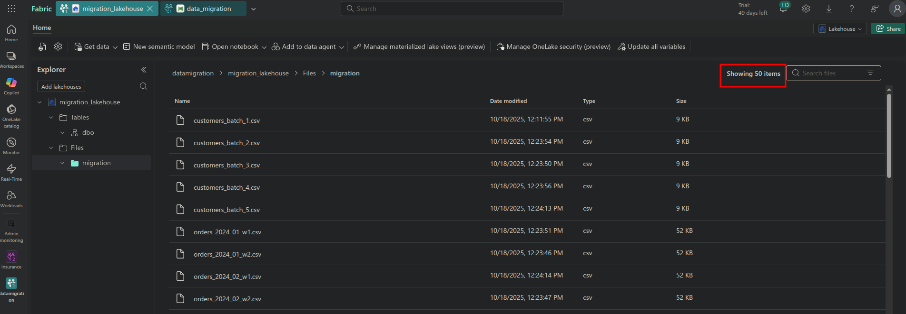

# 🔄 Data Migration Pipeline to Microsoft Fabric

[](https://www.python.org/)
[](#)
[](https://www.paramiko.org/)
[](https://www.sqlite.org/)
[](https://fabric.microsoft.com/)
[](#)
[](https://opensource.org/licenses/MIT)


> **Idempotent ETL pipeline preventing data reprocessing during large-scale migrations**

**idempotence** is the property that ensures running the same pipeline multiple times with the same input data will have the exact same result as running it only once.

---

## 🎯 Current Condition (The Problem)

Traditional ETL pipelines **lack state persistence**. When failures occur during large-scale migrations (50+ files), the system cannot track which files were already processed, forcing a complete re-run.

**Impact:** Duplicates, wasted time (45min recovery), unnecessary costs.

### Before: Traditional Pipeline (No Metadata)
```
┌─────────────────────────────────────────────────────┐
│  SFTP Source: 50 CSV Files                          │
└────────────┬────────────────────────────────────────┘
             │
             │ Execution 1
             ▼
    ┌────────────────────┐      ❌ NO METADATA
    │ Processing...      │         (No memory)
    │ ✓ File 1-29        │
    │ ❌ FAILURE at 30   │
    └────────────────────┘
             │
             │ Execution 2 (RE-RUN)
             ▼
    ┌────────────────────┐      ❌ Cannot query progress
    │ ⚠️  Reprocesses    │      ❌ No file status tracking
    │    ALL 50 files!   │
    │                    │      Result: Reprocess everything
    │ ❌ Duplicates      │
    │ ❌ Wasted 45min    │
    └────────────────────┘
```

---

## ✅ Solution (Proposed Condition)

**Idempotent pipeline** with SQLite-based FileTracker that maintains state across executions.

**Key change:** **Metadata tracking** - Store file processing state (file name, status, timestamp) in SQLite database.

**How it works:**
1. Before processing: Query metadata → Get list of completed files
2. During processing: Download + Upload → Mark status = `LOADED_TO_FABRIC` in metadata
3. On retry: Query metadata → Skip completed → Process only remaining files

### After: FileTracker Pipeline (With Metadata)

```
┌─────────────────────────────────────────────────────┐
│  SFTP Source: 50 CSV Files                          │
└────────────┬────────────────────────────────────────┘
             │
             │ Step 1: Query metadata
             ▼
    ┌────────────────────┐      ┌─────────────────────────────┐
    │ Query FileTracker  │ ←──→ │ ✅ METADATA DATABASE (SQLite)│
    │ Get pending files  │      │ ┌─────────────────────────┐ │
    └────────┬───────────┘      │ │ file_name | status     │ │
             │                  │ │ file_1.csv| LOADED ✅  │ │
             │                  │ │ file_2.csv| LOADED ✅  │ │
             │                  │ │ ...                    │ │
             │                  │ │ file_30.csv| LOADED ✅ │ │
             │                  │ │ file_31.csv| PENDING ⏳│ │
             │                  │ └─────────────────────────┘ │
             │                  └─────────────────────────────┘
             │ Step 2: Filter (skip completed)
             ▼
    ┌────────────────────┐
    │ Smart Filter       │      ✅ Queries metadata:
    │ Already done: 30   │         "SELECT * WHERE status != 'LOADED'"
    │ To process: 20     │      ✅ ONLY NEW FILES
    └────────┬───────────┘
             │
             │ Step 3: Process + Update metadata
             ▼
    ┌────────────────────┐      ┌─────────────────────────────┐
    │ FOR EACH file:     │      │ UPDATE metadata:            │
    │ 1. Download        │  ──→ │ SET status='LOADED'         │
    │ 2. Upload to Fabric│      │ SET uploaded_at=NOW()       │
    │ 3. Mark complete   │      │ WHERE file_name='file_31'   │
    └────────────────────┘      └─────────────────────────────┘
             │
             ▼
    ┌────────────────────┐
    │ ✅ Success         │      Result: Metadata enables
    │ No duplicates      │              idempotent retries
    │ Recovery: 5min     │
    └────────────────────┘
```


### 3. Reason for Change

| Metric        | Traditional      | FileTracker | Improvement   |
|--------       |-------------     |-------------|-------------  |
| Recovery time | ~45 min          | ~5 min      | ⚡ 90% faster |
| Duplicates    | High risk        | Zero        | 🛡️ Eliminated |
| Safe retries  | ❌ No            | ✅ Yes      | Idempotent    |

📊 **[Full Problem Definition with Diagrams](docs/problem_definition.md)**

---

## 🏗️ Technical Stack

**Core Technologies:**
- **Python 3.8+**: Orchestration
- **Paramiko**: SFTP client
- **SQLite**: State management
- **Microsoft Fabric**: Cloud data platform (OneLake REST API)

**Architecture Pattern:** Idempotent design with persistent state tracking

---

## 📁 Project Structure

```
fabric-data-migration/
├── src/
│   ├── ingestion.py          # SFTP download logic
│   ├── fabric_client.py      # Microsoft Fabric upload (REST API)
│   └── utils/
│       └── file_tracker.py   # SQLite state management
├── scripts/
│   ├── simulate_partial_failure.py  # Automated demo
│   └── demo_idempotency.py 
│   └── manage_tracker.py
├── docs/
│   ├── problem_definition.md         # Manual demo
├── data/
│   ├── staging/              # Temporary: Downloaded CSVs
│   └── tracker.db            # Persistent: File processing state
├── run_pipeline.py           # Main entry point
├── config.py                 # Environment configuration
└── .env.example              # Configuration template
```

---

## 🚀 Quick Start

### 1. Install Dependencies
```bash
python -m venv venv
source venv/bin/activate  # Windows: venv\Scripts\activate
pip install -r requirements.txt
```

### 2. Configure Environment
Create `.env` file (use `.env.example` as template):
```bash
# SFTP Configuration
SFTP_HOST=your-server.com
SFTP_USERNAME=your_user
SFTP_PASSWORD=your_password
SFTP_SERVER_PATH=data/raw

# Microsoft Fabric (get from Azure Portal)
FABRIC_WORKSPACE_ID=your-workspace-guid
FABRIC_LAKEHOUSE_ID=your-lakehouse-guid
AZURE_TENANT_ID=your-tenant-guid
AZURE_CLIENT_ID=your-client-guid
AZURE_CLIENT_SECRET=your-secret
```

### 3. Run Pipeline
```bash
# Full migration
python run_pipeline.py

# Test idempotency (simulate failure at file #31)
python run_pipeline.py --max-files 30
python run_pipeline.py  # Processes only remaining 20 files
```

📘 **[Idempotency Demo & Testing](docs/problem_definition.md#demo--testing)**

---

## 🔑 Key Features

- ✅ **Idempotent**: Safe to re-run without duplicates
- ✅ **Resumable**: Continues from last successful file
- ✅ **Testable**: `--max-files` flag for failure simulation
- ✅ **Auditable**: SQLite tracks all processing history
- ✅ **Production-ready**: Error handling, logging, retry logic

---

## 📸 Visual Evidence

Real Microsoft Fabric integration validated with production screenshots:

**Execution 1 → 30 files uploaded** | **Execution 2 → 50 files total (no duplicates)**



📊 **[Full Visual Evidence](docs/problem_definition.md#visual-evidence-production-validation)**

---

## 👤 Author

**Daniel Garcia Belman**
Data Engineer | Python Developer | Big Data
- Email: danielgb331@outlook.com
- GitHub: [@Daniel-jcVv](https://github.com/Daniel-jcVv/Daniel-jcVv)
- LinkedIn: [My LinkenIn Profile](www.linkedin.com/in/daniel-garcía-belman-99a298aa)

---

## 📄 License

This project is licensed under the MIT License - see the [LICENSE](LICENSE) file for details.

---

## 🙏 Acknowledgments
>
>**Ora et labora, ahora**
>**Soli Deo gloria**
>My gratitude to the open-source community for generously sharing their knowledge.
