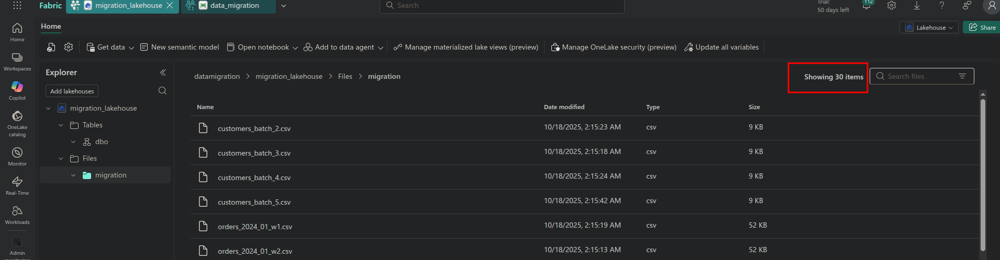

# Problem Definition: Idempotent Data Migration

## 1. Current Condition (Problem Definition)

**Context:** Migration of 50+ CSV files from SFTP server to Microsoft Fabric Lakehouse.

**Problem:** Traditional ETL pipelines **do not maintain state** between executions. When a failure occurs (timeout, network error, crash), the system cannot distinguish which files were already processed.

**Impact:**
```
Execution 1: Processing 50 files... ❌ Fails at file #30
Execution 2: Reprocesses ALL 50 files (includes 29 already migrated)
```

**Consequences:**
- ❌ **Duplicates**: Files re-loaded multiple times
- ❌ **Wasted time**: 45min reprocessing 29 already-completed files
- ❌ **Cost**: Unnecessary bandwidth and compute usage

### Visual: Traditional Pipeline (No Metadata Tracking)

```
┌─────────────────────────────────────────────────────┐
│  SFTP Source: 50 CSV Files                          │
└────────────┬────────────────────────────────────────┘
             │
             │ Execution 1
             ▼
    ┌────────────────────┐      ❌ NO METADATA STORAGE
    │ Processing...      │         (No memory of progress)
    │ ✓ File 1-29       │
    │ ❌ FAILURE at 30   │
    └────────────────────┘
             │
             │ Execution 2 (RE-RUN)
             ▼
    ┌────────────────────┐      ❌ Cannot query "What succeeded?"
    │ ⚠️  Reprocesses    │      ❌ No file status metadata
    │    ALL 50 files!   │      ❌ No completion timestamps
    │                    │
    │ ❌ Duplicates      │      Result: Must reprocess everything
    │ ❌ Wasted 45min    │
    └────────────────────┘
```

---

## 2. Proposed Condition (Solution)

Implement an **idempotent pipeline** with SQLite-based persistent tracking system.

**Key change:** Record the state of each file in database (`PENDING`, `DOWNLOADED`, `LOADED_TO_FABRIC`).

**Expected behavior:**
```
Execution 1: Processing 50 files... ❌ Fails at file #30
Execution 2: Query tracker.db → Skip 29 completed → Process only 21 remaining
```

**Benefits:**
- ✅ **Zero duplicates**: Processed files never re-loaded
- ✅ **Fast recovery**: 5min vs 45min (90% faster)
- ✅ **Guaranteed idempotency**: Re-executable without side effects

### Visual: FileTracker Pipeline (With Metadata Tracking)

```
┌─────────────────────────────────────────────────────┐
│  SFTP Source: 50 CSV Files                          │
└────────────┬────────────────────────────────────────┘
             │
             │ Step 1: Query metadata
             ▼
    ┌────────────────────┐      ┌─────────────────────────────┐
    │ Query FileTracker  │ ←──→ │ ✅ METADATA DATABASE (SQLite)│
    │ Get pending files  │      │ ┌─────────────────────────┐ │
    └────────┬───────────┘      │ │ file_name | status     │ │
             │                  │ │ file_1.csv| LOADED ✅  │ │
             │                  │ │ file_2.csv| LOADED ✅  │ │
             │                  │ │ ...                    │ │
             │                  │ │ file_29.csv| LOADED ✅ │ │
             │                  │ │ file_30.csv| PENDING ⏳│ │
             │                  │ └─────────────────────────┘ │
             │                  └─────────────────────────────┘
             │ Step 2: Filter (skip completed)
             ▼
    ┌────────────────────┐
    │ Smart Filter       │      ✅ Queries metadata:
    │ Already done: 29   │         "SELECT * WHERE status != 'LOADED'"
    │ To process: 21     │      ✅ ONLY NEW FILES
    └────────┬───────────┘
             │
             │ Step 3: Process + Update metadata
             ▼
    ┌────────────────────┐      ┌─────────────────────────────┐
    │ FOR EACH file:     │      │ UPDATE metadata:            │
    │ 1. Download        │  ──→ │ SET status='LOADED'         │
    │ 2. Upload to Fabric│      │ SET uploaded_at=NOW()       │
    │ 3. Mark complete   │      │ WHERE file_name='file_30'   │
    └────────────────────┘      └─────────────────────────────┘
             │
             ▼
    ┌────────────────────┐
    │ ✅ Success         │      Result: Metadata enables
    │ No duplicates      │              idempotent retries
    │ Recovery: 5min     │
    └────────────────────┘
```

---

## 3. Reason for Change (Technical Explanation)

**Root cause:** Stateless pipelines lack **execution memory**.

Traditional approach:
1. List files from SFTP
2. Process all files sequentially
3. If failure → lose all progress
4. On retry → no mechanism to skip completed files

**Technical problems avoided:**
- **Data duplication**: Same file uploaded multiple times to Fabric
- **Non-idempotent operations**: Unsafe to re-run after failure
- **Resource waste**: Re-downloading/re-uploading completed files
- **No audit trail**: Cannot verify which files were processed

**Solution mechanism:**

**Metadata Tracking** is the core enabler of idempotency:
- **State persistence**: SQLite database (`tracker.db`) stores metadata for each file:
  - `file_name`: Unique identifier
  - `status`: PENDING → DOWNLOADED → LOADED_TO_FABRIC → FAILED
  - `uploaded_at`: Timestamp of completion
  - `file_size`: Validation metadata
- **Atomic updates**: File marked `LOADED_TO_FABRIC` **only after** successful upload to Fabric
- **Filtering logic**: `get_pending_files()` queries metadata to exclude completed files
- **Safe retries**: Re-running pipeline reads metadata → skips completed work automatically

**Why metadata matters:**
- Without metadata: System has no memory → must reprocess everything
- With metadata: System knows exactly which files succeeded → processes only remaining files

---

## 4. Implementation Plan

### Core Components

**1. FileTracker (State Management)**
```python
class FileTracker:
    def get_pending_files(self, available_files: List[str]) -> List[str]:
        """Filter files that need processing."""
        completed = query_db("SELECT file_name WHERE status = 'LOADED_TO_FABRIC'")
        pending = [f for f in available_files if f not in completed]
        return pending
```

**2. Pipeline Flow**
```
SFTP Server → List files → FileTracker.get_pending_files()
  → Download pending → Upload to Fabric → Mark LOADED_TO_FABRIC
```

**3. Database Schema**
```sql
CREATE TABLE file_status (
    file_name TEXT PRIMARY KEY,
    status TEXT,  -- PENDING, DOWNLOADED, LOADED_TO_FABRIC, FAILED
    uploaded_at TIMESTAMP,
    file_size INTEGER
);
```

### Execution Scenarios (Metadata in Action)

**Execution 1 (Simulated Failure):**
```
Command: python run_pipeline.py --max-files 30

Process:
┌─────────────┐
│ File 1-30   │  ✅ Downloaded → Uploaded → UPDATE metadata
└─────────────┘

Metadata state after Execution 1:
┌──────────────┬─────────────────┬──────────────────┐
│ file_name    │ status          │ uploaded_at      │
├──────────────┼─────────────────┼──────────────────┤
│ file_1.csv   │ LOADED_TO_FABRIC│ 2025-10-18 10:00│
│ file_2.csv   │ LOADED_TO_FABRIC│ 2025-10-18 10:01│
│ ...          │ ...             │ ...              │
│ file_30.csv  │ LOADED_TO_FABRIC│ 2025-10-18 10:29│
│ file_31.csv  │ PENDING         │ NULL             │
│ ...          │ PENDING         │ NULL             │
│ file_50.csv  │ PENDING         │ NULL             │
└──────────────┴─────────────────┴──────────────────┘

Result: 30 LOADED, 20 PENDING (tracked in metadata)
```

**Execution 2 (Idempotent Retry):**
```
Command: python run_pipeline.py

Pipeline queries metadata:
  1. SELECT file_name FROM file_status WHERE status = 'LOADED_TO_FABRIC'
     → Returns: file_1 to file_30
  2. get_pending_files() → Filters out completed files
     → Returns: file_31 to file_50 (ONLY 20 files)

Process:
┌─────────────┐
│ File 1-30   │  ⏭️  SKIPPED (metadata shows LOADED_TO_FABRIC)
├─────────────┤
│ File 31-50  │  ✅ Downloaded → Uploaded → UPDATE metadata
└─────────────┘

Metadata state after Execution 2:
┌──────────────┬─────────────────┬──────────────────┐
│ file_name    │ status          │ uploaded_at      │
├──────────────┼─────────────────┼──────────────────┤
│ file_1.csv   │ LOADED_TO_FABRIC│ 2025-10-18 10:00│ ← Unchanged
│ ...          │ ...             │ ...              │ ← Unchanged
│ file_30.csv  │ LOADED_TO_FABRIC│ 2025-10-18 10:29│ ← Unchanged
│ file_31.csv  │ LOADED_TO_FABRIC│ 2025-10-18 11:05│ ← NEW
│ ...          │ LOADED_TO_FABRIC│ ...              │ ← NEW
│ file_50.csv  │ LOADED_TO_FABRIC│ 2025-10-18 11:24│ ← NEW
└──────────────┴─────────────────┴──────────────────┘

Result: 50 LOADED_TO_FABRIC
✅ Zero reprocessing (metadata prevented duplicate uploads)
```

### Production Benefits

| Aspect | Traditional | FileTracker | Improvement |
|--------|-------------|-------------|-------------|
| Recovery time | ~45 min | ~5 min | 90% faster |
| Duplicates | High risk | Zero | 100% elimination |
| Safe retries | ❌ No | ✅ Yes | Idempotent |
| Audit trail | ❌ None | ✅ SQLite | Full history |

---

## Visual Evidence (Production Validation)

**Execution 1: Partial Upload (30 files)**


*Screenshot shows 30 CSV files successfully uploaded to Fabric Lakehouse after simulated failure.*

**Execution 2: Complete Migration (50 files total)**


*Screenshot validates idempotent behavior: 20 new files added without reprocessing the original 30.*

**Key observations:**
- ✅ No duplicate files (50 total, not 80)
- ✅ Metadata tracking prevented reprocessing
- ✅ Real Microsoft Fabric integration (not theoretical)

---

## Demo & Testing

```bash
# Automated simulation
python scripts/simulate_partial_failure.py

# Manual testing
python run_pipeline.py --max-files 30  # Simulate failure at file #31
python run_pipeline.py                  # Idempotent retry (processes only 31-50)
```

